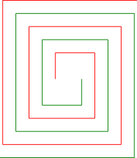

# Rectangular Spiral Resonator **RSR**

Simply call the function
```python
double_square_spiral_fermat(dx=5,dyi=5,xg=5,yg=5)
```
$dx$ initial $x$ value\
$dy$ initial $y$ value \
$xg$ (xgrow) control the expansion on x-abciss\
$yg$ (xgrow) control the expansion over y-abciss\
$xorig$ origin on x-axes\
$xorig$ origin on y-axes\
$turn$ number of turns\
$swidth$ with of the line
```
dx,dyi,xg,yg,xorig,yorig,turn,swidth)
```

# Example of generated files
> ## RSR with Polylines
<p>
&nbsp;
</p>


> ## RSR with Lines
<p>
&nbsp;
</p>
